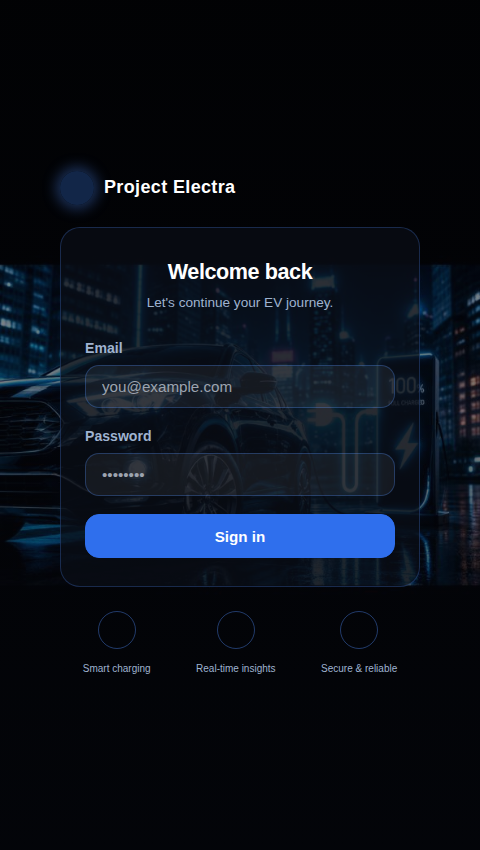
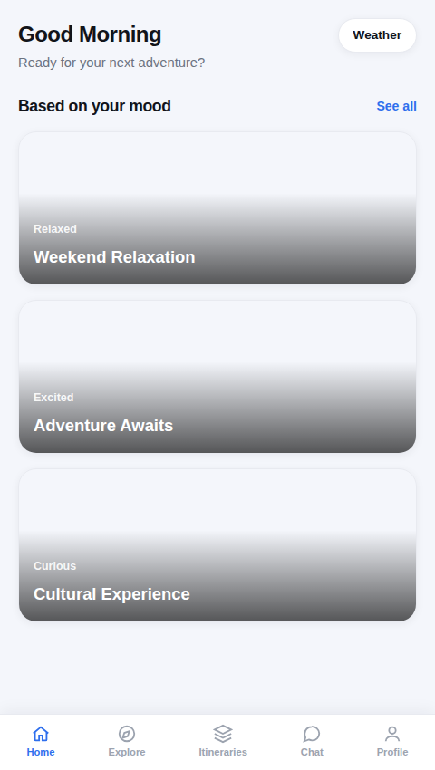
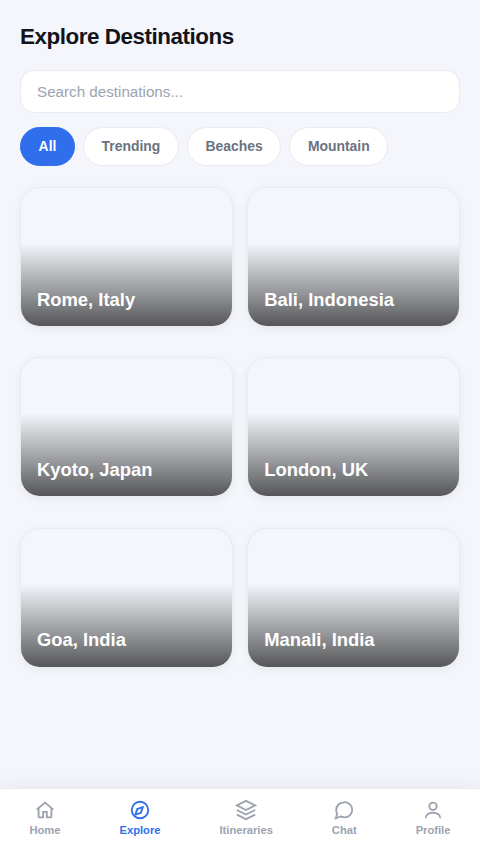
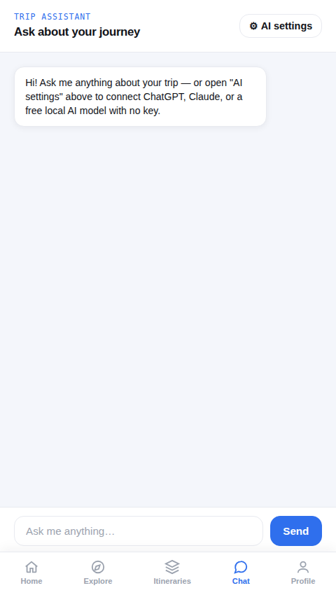

# Project Electra

Know exactly how far your EV will go, and where to charge along the way.

## Preview of the Project







## What it does

Project Electra is an EV trip planner that answers the question every electric vehicle
owner actually cares about before a drive: **can my car make this trip on its current
charge, or do I need to stop and charge along the way — and if so, where?**

- **Real routing** — enter a starting point and destination and get an actual driving
  route (OpenStreetMap's OSRM engine), with real distance and drive time
- **Trip feasibility, front and center** — enter your vehicle's battery capacity and
  efficiency, and the app tells you plainly whether you'll make it on one charge or need
  stops, with a 10% safety reserve built in
- **Real charging stations** — pulled live from OpenChargeMap and matched to the actual
  points along your route where you'd need to stop
- **Vehicle picker** — pick a real EV preset (Tata Nexon EV, Hyundai Kona Electric, MG ZS
  EV, Tesla Model 3) or enter custom specs
- **Best vs. worst route comparison**
- **Cost and CO2 estimates** — clearly labeled as estimates
- **AI trip assistant** — free built-in mode, or connect a real OpenAI/Anthropic key, or
  run a model fully in-browser with no key (WebLLM)
- **Itineraries and profile** — trips saved locally

## Running it

Single, self-contained HTML file — no install, no build step.

```bash
open electra-demo.html
```

Or just double-click it, or drag it into a browser window.

## Tech stack

- **Routing:** [OSRM](http://project-osrm.org/)
- **Geocoding:** [Nominatim](https://nominatim.org/)
- **Charging stations:** [OpenChargeMap](https://openchargemap.org/)
- **Weather:** [Open-Meteo](https://open-meteo.com/)
- **Maps:** [Leaflet](https://leafletjs.com/) + OpenStreetMap tiles
- **AI (optional):** OpenAI / Anthropic APIs, or [WebLLM](https://github.com/mlc-ai/web-llm)
- Plain HTML / CSS / JavaScript — no framework, no build tooling

## Known limitations

- Uses free, public-tier APIs — fine for demos and personal use, rate-limited for
  production traffic
- Cost and CO2 figures are estimates, not measured data
- No real backend yet — sign-in and itineraries are local to the browser
  (localStorage), not a shared database

## Roadmap

A production-track FastAPI backend (auth, database, migrations, Docker) is being built
separately, module by module.

## License

Add a license of your choice (MIT is a common default) before making this repo public.
